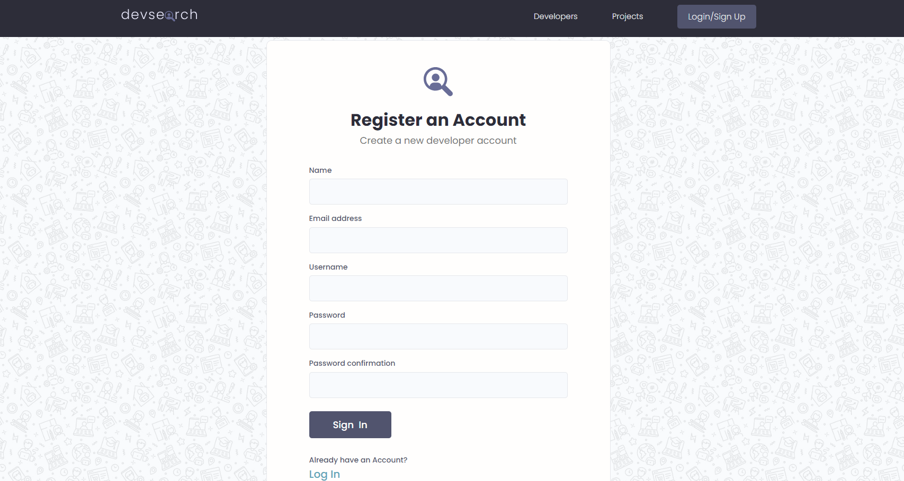
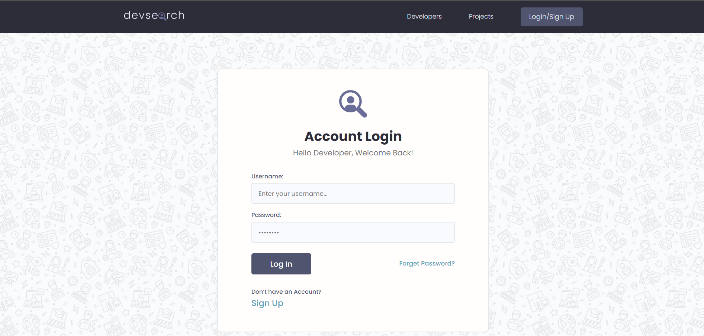
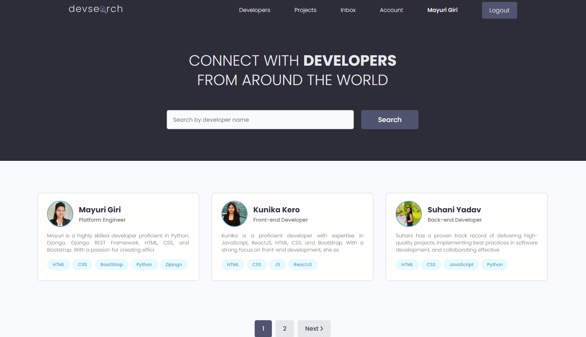
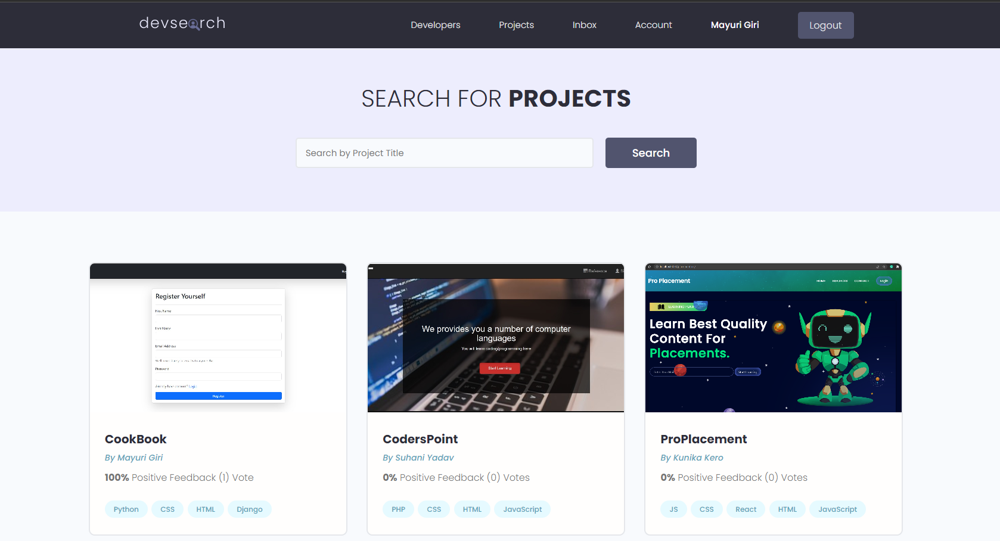
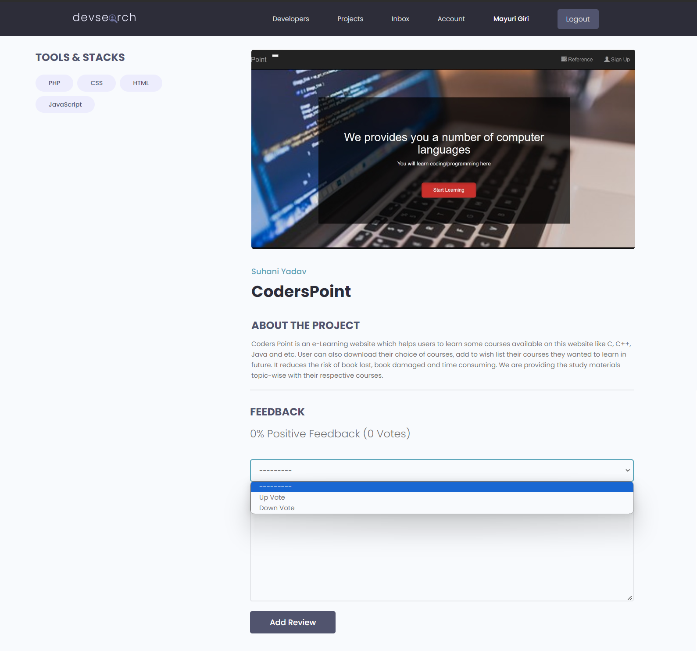
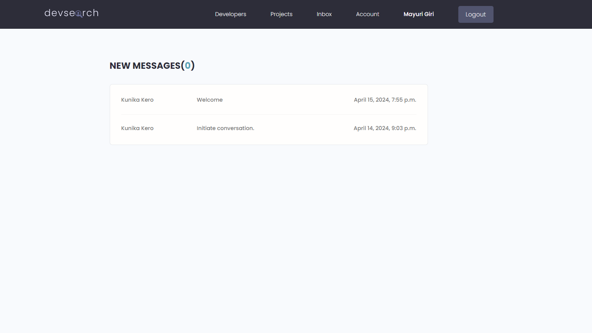

# DevSearch
DevSearch is a web platform designed to help developers connect, collaborate, and showcase their work. It’s like a big online community where developers can create profiles, share their skills and projects, and find others with similar interests. Build on Django.

# Installation
1. clone repo https://github.com/MayuriGiri1112/DevSearch
2. create a virtual environment and activate
  - pip install virtualenv
  - virtualenv env_name
  - env_name\scripts\activate
3. cd into project "cd DevSearch"
4. pip install -r requirements.txt
5. python manage.py runserver

# Features
* Sign Up
* Sign In
* Share Projects
* Message other developers
* Rate others work
* Search other developers
* User Registration & Authentication

# Tech Stack
* HTML
* CSS
* BootStrap
* Django
* Postgres
* Django REST Framework

# Softwares Used:
* VS Code
* DB Browser (SQlite)
* Postman
* Github

# Registration Page
 

# Login Page
 

# Home Page
 

# Profile Page
  

# Projects Page
  

# Rate Project Page
 

# User Inbox
  

