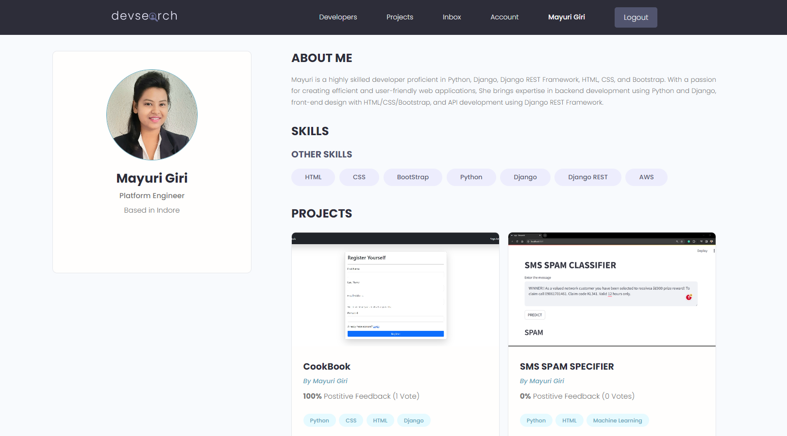

# DevSearch
Sourcode and Resources for Django 2021 Course

# Installation
* 1 - clone repo https://github.com/divanov11/Django-2021
* 2 - create a virtual environment and activate
  - pip install virtualenv
  - virtualenv envname
  - envname\scripts\activate
* 3 - cd into project "cd django-2021"
* 4 - pip install -r requirements.txt
* 5 - python manage.py runserver

# Features
* Share Projects
* Message other developers
* Rate others work
* Search other developers

# Course Overview
* Basic Django Overview
* Database Design and Models
* Static Files
* User Registration & Authentication
* Search
* Pagination
* Building an API with Django REST Framework (DRF)

# Tech Stack
* Django
* Postgres
* Django REST Framework

# Registration Page
 

# Login Page
 

# Home Page
 

# Profile Page
  

# Projects Page
  

# Rate Project Page
 

# User Inbox
  

